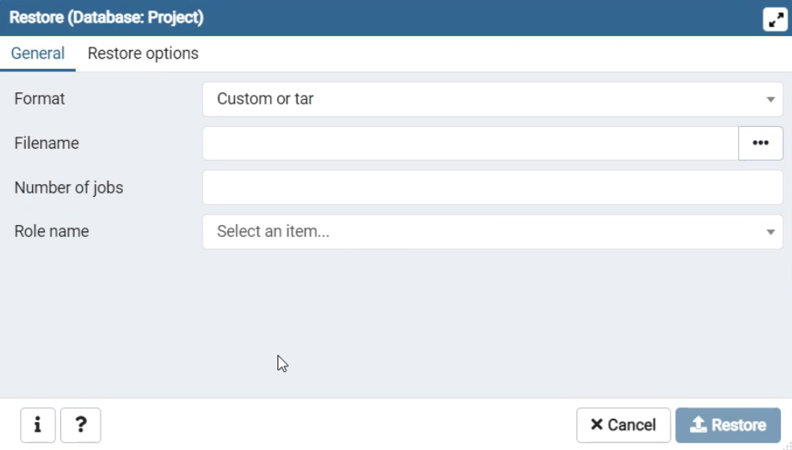
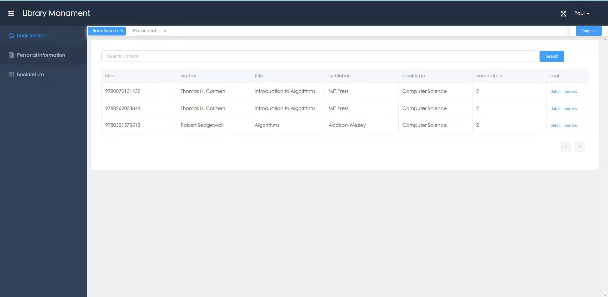
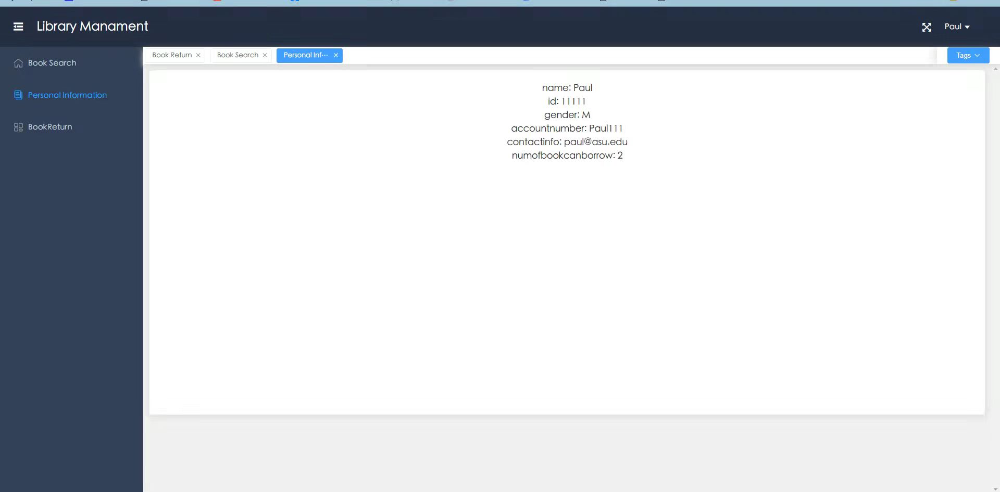
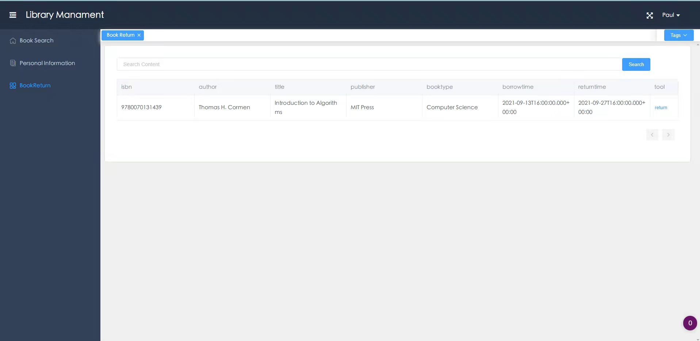

# CSE412-G15-Project

User Manual for the CSE 412 Group Project.

## Indtruoduction

This is a web-based application offers the service of searching book information, renting books, and sharing comments. This repository contains the full stack application and complete source codes. We also offer the database dump so you can build the local database with PostgreSQL. The main purpose of this project is to demonstrate our understanding of modern databases and our ability to apply them in practice after learning in CSE412 with Dr.Jia Zou during Fall 2021.

## Contents

 - [Prerequisites](#Prerequisites)
 - [Database Details](#Database-Details)
 - [User Manual](#User-Manual)
 - [Development&Running Environment](#developmentrunning-environment)
 - [Project Developing Progress](#Project-Developing-Progress)

## Prerequisites

 - PostgreSQL
 - IDEA
 - HbuilderX
 - Java1.8
 - SpringBoot
 - Vue2
 - Node.js
 - npm

## Database Details
### Schema

For this project, we create the database on local server. We also provide the code and tutorial for users to build the database on their own local machine. The relational database model contains 4 entities. Because we need to implement some basic features of a system in a library, we need the four entities to interact with each other. They are Administrator, Reader, Book, and BookComment.

### ER Diagram

### ER-to-Realational

- Administrator: (ID, Name, Gender, password, contactInfo, accountNumber)
- Reader: (ID, numOfBookCanBorrow, Name, Gender, password, contactInfo, accountNumber)
- updateBook: (ID, ISBN)
- Borrow: (ID, ISBN, BorrowTime, ReturnTime)
- Book: (ISBN, author, Title, publisher, type, numInStock)
- BookComment: (commentID, rate, content, postTime)
- Post: (commentID, ID)
- HasA: (commentID, ISBN)

In order to create the database system in PostgreSQL, we need to transform them to following SQL DDL:

#### Administrator Table

~~~~sql
CREATE TABLE Administrator (
ID INTEGER NOT NULL,
Name VARCHAR(20),
Gender CHAR(1),
password VARCHAR(20),
contactInfo VARCHAR(20),
accountNumber VARCHAR(20),
PRIMARY KEY (ID)
);
~~~~

#### Reader Table

~~~~sql
CREATE TABLE Reader (
ID INTEGER NOT NULL,
Name VARCHAR(20),
Gender CHAR(1),
password VARCHAR(20),
contactInfo VARCHAR(20),
accountNumber VARCHAR(20),
numOfBookCanBorrow INTEGER,
PRIMARY KEY (ID)
);
~~~~

#### Book Table

~~~~sql
CREATE TABLE Book(
ISBN CHAR(13),
author VARCHAR(30),
Title VARCHAR(100),
publisher VARCHAR(100),
bookType VARCHAR(100),
numInStock INTEGER,
PRIMARY KEY (ISBN)
);
~~~~

#### updateBook Table

~~~~sql
CREATE TABLE updateBook (
ID INTEGER NOT NULL,
ISBN CHAR(13),
PRIMARY KEY (ID, ISBN),
FOREIGN KEY (ID)
REFERENCES Administrator ON DELETE CASCADE,
FOREIGN KEY (ISBN)
REFERENCES Book ON DELETE CASCADE
);
~~~~

#### Borrow Table

~~~~sql
CREATE TABLE Borrow(
ID INTEGER NOT NULL,
ISBN CHAR(13),
BorrowTime DATE,
ReturnTime DATE,
PRIMARY KEY (ID, ISBN),
FOREIGN KEY(ID)
REFERENCES Reader ON DELETE CASCADE,
FOREIGN KEY (ISBN)
REFERENCES Book ON DELETE CASCADE
);
~~~~

#### bookComment Table

~~~~sql
CREATE TABLE bookComment(
commentID INTEGER NOT NULL,
rate INTEGER,
content VARCHAR(300),
postTime DATE,
PRIMARY KEY(commentID)
);
~~~~

#### Post Table

~~~~sql
CREATE TABLE Post(
commentID INTEGER NOT NULL,
ID INTEGER NOT NULL,
PRIMARY KEY (commentID),
FOREIGN KEY (commentID)
REFERENCES bookComment ON DELETE CASCADE,
FOREIGN KEY (ID)
REFERENCES Reader ON DELETE CASCADE
);
~~~~

#### HasA Table

~~~~sql
CREATE TABLE HasA(
commentID INTEGER NOT NULL,
ISBN CHAR(13),
PRIMARY KEY(commentID),
FOREIGN KEY(commentID)
REFERENCES bookComment ON DELETE CASCADE,
FOREIGN KEY(ISBN)
REFERENCES Book ON DELETE CASCADE
);
~~~~

## User Manual

### Installation Database

1. Download all files in our project
2. Create a Postgres database
3. Open pgAdmin(the example is given based on pgAdmin4)
4. Double right click the database you created
5. Click Restore

   
6. Select the location where you download the files, a database backup file named LMS is in database folder

   
7. Click restore

### Development&Running Environment

#### Setting up environment
- About our project, the tools that we used for development include: "IDEA", "HBuilder X", "java", "Node.js" and "npm".
- For "IDEA", if you haven't install it yet, you can download from this link: https://www.jetbrains.com/idea/download/#section=windows

- For "HBuilder X", if you haven't install it yet, you can download from this link: https://www.dcloud.io/hbuilderx.html

- For "java", you can first check whether you install it by input the command: "java -version" in your terminal, if it show up the version, you don't need to install it again, else you can download and install from this link: https://www.oracle.com/java/technologies/downloads/#java8

- For "Node.js", you can first check whether you install it by input the command: "node -v" in your terminal, if it show up the version, you don't need to install it again, else you can download and install from this link: https://nodejs.org/en/

- For "npm", you can first check whether you install it by input the command: "npm -v" in your terminal, if it show up the version, you don't need to install it again, else you can download the latest version of npm, on the command line, run the following command: "npm install -g npm"

#### Ready to run
- 1. In order to run it, you should open the PostgreSQL using pgAdmin. 
- 2. Open the IDEA, run the back-end application which is the folder named libarary. If you can't run successfully, please check and make sure you have change it to spring boot in configuration. 
- 3. Open the HbuilderX to run the front-end application. Entering the <em>front-end</em> folder using cd command in terminal. Then run following commands.
~~~~
npm install(if doesn't work, try npm install --force)
npm run serve
~~~~
- 4. Now there should be a url link show in terminal which is the URL you will use to access our full application. It should be "http://localhost:8081"
- 5. If you want to log in as an admin user, you need to rerun these commands but in folder <em>admin</em>
~~~~
npm install(if doesn't work, try npm install --force)
npm run serve
~~~~
- 5. Now there should be anoterh URL link which should be "http://localhost:8082". This is used to log in as Admin user.
- 6. You can switch between these two URLs at will, they will be both accessible.

### Functionality

#### Log-in
- On this page, you can sign-in as a reader user at "http://localhost:8081". Entering the reader account number and the corresponding password, then clicking Login button. This will navigate you to the reader version interface.

- Or you can sign-in as an admin user at "http://localhost:8082". Entering the admin account number and the corresponding password, then clicking Login button. This will navigate you to the admin version interface.

#### Booksearch Page
1. Reader
- At this page, you will see a list and a form of existing books. 
- You could see the information including ISBN number, author, title, publisher, book type, and number in stock.
- As a user, you can also borrow a book by clicking the borrow buttion at the most right side.

2. Manager

#### Personal Information Page

#### Book Return Page

## Project Developing Progress
- This project is developed during Fall 2021 semester. The whole process is divided into 3 different phases.
### Phase1-Proposal
- From 08/23 to 09/15
- 1. We defined our detailed application requirements. 
- 2. We designed the ER diagram. 
- 3. We defined our implementation plans.
- 4. We gave a video presentation.
### Phase2-Project Midterm Report
- From 09/20 to 10/27
- 1. Transform the ER diagram into a relational model using SQL data definition language (DDL).
- 2. Fill in the database with data.
- 3. SQL Queries: Prepare examples of SQL queries that cover the application description.
### Phase3-Project Final Report
- From 11/01 to 12/2
- 1. Deliverd the the first version of our web-based full stack app including front-end and back-end.
- 2. Offered the project description and user manual.
- 3. Gave a video demontration of our application.
