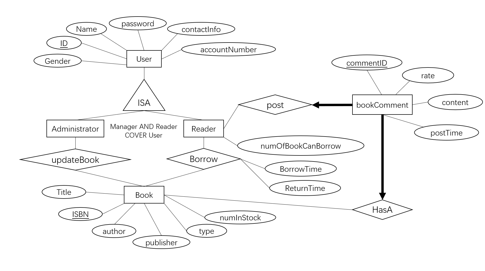

# CSE412-G15-Project

User Manual for the CSE 412 Group Project.

## Indtruoduction

This is a web-based application offers the service of searching book information, renting books, and sharing comments. This repository contains the full stack application and complete source codes. We also offer the database dump so you can build the local database with PostgreSQL. The main purpose of this project is to demonstrate our understanding of modern databases and our ability to apply them in practice after learning in CSE412 with Dr.Jia Zou during Fall 2021.

## Contents

 - [Prerequisites](#Prerequisites)
 - [Database Details](#Database-Details)
 - [Installation](#Installation)
 - [Functionality](#Functionality)

## Prerequisites

 - PostgreSQL
 - IDEA
 - HbuilderX
 - Java(SpringBoot)
 - vue2
 - Local server (such as HTTP Simple Server)

## Database Details
### Schema

For this project, we create the database on local server. We also provide the code and tutorial for users to build the database on their own local machine. The relational database model contains 4 entities. Because we need to implement some basic features of a system in a library, we need the four entities to interact with each other. They are Administrator, Reader, Book, and BookComment.

### ER Diagram

### ER-to-Realational

- Administrator: (ID, Name, Gender, password, contactInfo, accountNumber)
- Reader: (ID, numOfBookCanBorrow, Name, Gender, password, contactInfo, accountNumber)
- updateBook: (ID, ISBN)
- Borrow: (ID, ISBN, BorrowTime, ReturnTime)
- Book: (ISBN, author, Title, publisher, type, numInStock)
- BookComment: (commentID, rate, content, postTime)
- Post: (commentID, ID)
- HasA: (commentID, ISBN)

In order to create the database system in PostgreSQL, we need to transform them to following SQL DDL:

#### Administrator Table

~~~~sql
CREATE TABLE Administrator (
ID INTEGER NOT NULL,
Name VARCHAR(20),
Gender CHAR(1),
password VARCHAR(20),
contactInfo VARCHAR(20),
accountNumber VARCHAR(20),
PRIMARY KEY (ID)
);

~~~~

#### Reader Table

CREATE TABLE Reader (
ID INTEGER NOT NULL,
Name VARCHAR(20),
Gender CHAR(1),
password VARCHAR(20),
contactInfo VARCHAR(20),
accountNumber VARCHAR(20),
numOfBookCanBorrow INTEGER,
PRIMARY KEY (ID)
);

#### Book Table

CREATE TABLE Book(
ISBN CHAR(13),
author VARCHAR(30),
Title VARCHAR(100),
publisher VARCHAR(100),
bookType VARCHAR(100),
numInStock INTEGER,
PRIMARY KEY (ISBN)
);

#### updateBook Table

CREATE TABLE updateBook (
ID INTEGER NOT NULL,
ISBN CHAR(13),
PRIMARY KEY (ID, ISBN),
FOREIGN KEY (ID)
REFERENCES Administrator ON DELETE CASCADE,
FOREIGN KEY (ISBN)
REFERENCES Book ON DELETE CASCADE
);

#### Borrow Table

CREATE TABLE Borrow(
ID INTEGER NOT NULL,
ISBN CHAR(13),
BorrowTime DATE,
ReturnTime DATE,
PRIMARY KEY (ID, ISBN),
FOREIGN KEY(ID)
REFERENCES Reader ON DELETE CASCADE,
FOREIGN KEY (ISBN)
REFERENCES Book ON DELETE CASCADE
);

#### bookComment Table

CREATE TABLE bookComment(
commentID INTEGER NOT NULL,
rate INTEGER,
content VARCHAR(300),
postTime DATE,
PRIMARY KEY(commentID)
);

#### Post Table

CREATE TABLE Post(
commentID INTEGER NOT NULL,
ID INTEGER NOT NULL,
PRIMARY KEY (commentID),
FOREIGN KEY (commentID)
REFERENCES bookComment ON DELETE CASCADE,
FOREIGN KEY (ID)
REFERENCES Reader ON DELETE CASCADE
);

#### HasA Table

CREATE TABLE HasA(
commentID INTEGER NOT NULL,
ISBN CHAR(13),
PRIMARY KEY(commentID),
FOREIGN KEY(commentID)
REFERENCES bookComment ON DELETE CASCADE,
FOREIGN KEY(ISBN)
REFERENCES Book ON DELETE CASCADE
);

## Installation

    1.
    2.
    3.

## Functionality
### Log-in & Sign-in Page

### Reader & manager Search
1. Reader

2. Manager

### Personal Information

### Book Return

